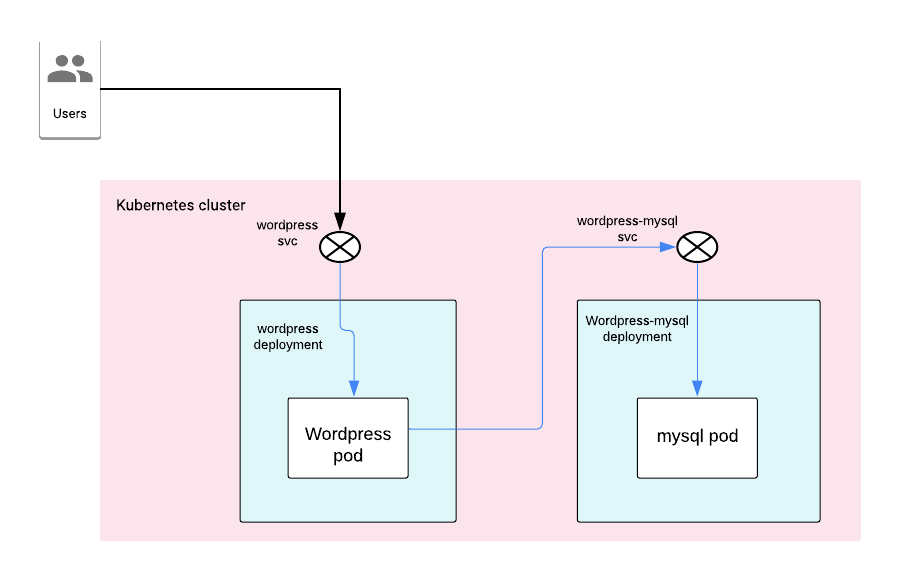

이번에는 WordPress를 Kubernetes에 배포하고 문서를 작성해 보는 실습을 진행하겠습니다.

우선 Kubernetest를 구동시키기 위해 `launch.sh`{{execute}}를 실행시킵니다.

이제 실습을 위해 디렉토리를 이동합니다.

`cd /root/lab`{{execute}}

## 목표 Architecture

WordPress 홈페이지 (https://wordpress.org/support/article/requirements/) 에서 확인하면, WordPress는 MySQL이나 MariaDB를 Database로 사용할 수 있다고 되어 있습니다.

위의 그림처럼 WordPress와 MySQL 두개의 Pod을 생성하고, 각각 Service를 붙여서 외부 및 내부 통신을 담당하게 하면 될 것입니다.

혹은, 하나의 Pod 내에 WordPress와 MySQL Container를 모두 담을 수도 있겠지만 권장하는 방법이 아니라고 이미 말씀 드렸습니다.

사용자는 wordPress Service (LoadBalancer Type 이나 NodePort Type)을 통해 WordPress Pod에 접근하고, WordPress Pod는 wordpress-mysql Service를 통해 MySQL Pod으로 접근하도로 구성하시면 됩니다.

WordPress Pod과 MySQL Pod은 Deployment에 의해 생성되도록 구성하세요.

다음 Step 들인 Tip들을 적어 놓았으니 참고하셔도 좋습니다.
